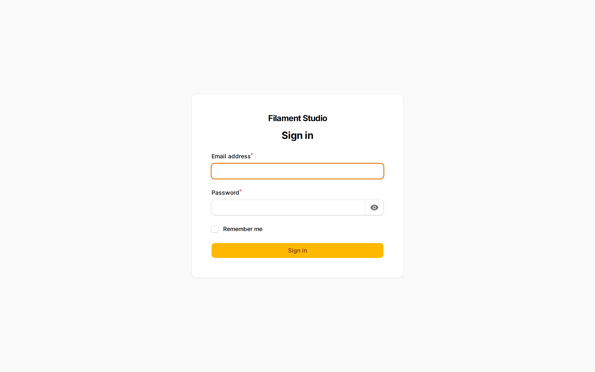
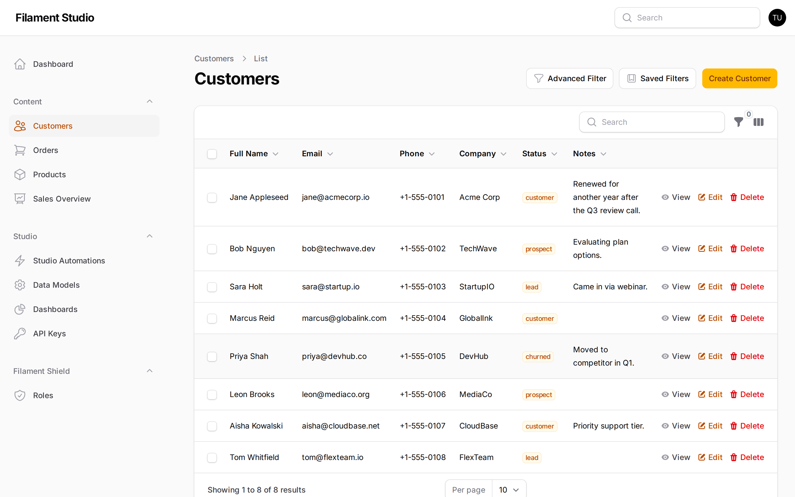

[← Back to contents](README.md) · Next: [Working with collections →](02-collections.md)

# 1. Signing in and finding your way around

## Signing in

Your panel lives at a web address someone in your organisation will have given you — usually your normal website address with `/admin` on the end.

Enter your email address and password and choose **Sign in**. If you tick *Remember me*, you'll stay signed in on that computer, so only use it on a device that's yours.

If you've forgotten your password, use the **Forgot password?** link if it's shown. If it isn't, your panel doesn't have self-service password resets turned on and you'll need to ask an administrator to reset it for you.

## The sidebar

Everything is reached from the sidebar on the left. It's grouped into sections.

Looking at the sidebar in the picture above:

**Content** — your actual data. Each collection someone has created appears here as its own entry: *Customers*, *Orders*, *Products*. This is where you'll spend most of your time. Dashboards you've been given access to also appear here, like *Sales Overview*.

**Studio** — the tools for setting things up rather than using them:

| Entry | What it's for |
|-------|---------------|
| **Data Models** | Create and change collections and their fields — the structure of your data |
| **Dashboards** | Build the summary pages of charts and numbers |
| **Studio Automations** | Set up things that happen automatically |
| **API Keys** | Let other software read and write your data |

**Filament Shield** — *Roles*, where you control who is allowed to do what. See [Controlling who can do what](08-permissions.md).

> **Don't see some of these?** The sidebar only shows what your account has permission to use. If *Data Models* isn't there, your account isn't allowed to change the structure of collections — which is often deliberate.

## The shape of every screen

Once you know one screen in Studio, you know most of them, because they're all built the same way.

Looking at the *Customers* screen above:

- **The breadcrumb trail** at the top (`Customers > List`) shows where you are. Click any part to go back.
- **The page title** tells you which collection you're looking at.
- **The buttons at the top right** are the actions for the whole page — here, *Advanced Filter*, *Saved Filters*, and *Create Customer*.
- **The table** is your data, one record per row.
- **The buttons at the end of each row** — *View*, *Edit*, *Delete* — act on that one record.
- **The controls at the bottom** show how many records there are and let you change how many appear per page.

## Two small things worth knowing

**Your profile menu** is the circle in the top right corner with your initials in it. That's where you sign out.

**Nothing saves until you say so.** When you're editing a record, your changes only take effect when you choose **Save changes**. If you navigate away without saving, your edits are discarded. This is deliberate — it means you can open a record, look around, and leave without any risk of changing it.

---

[← Back to contents](README.md) · Next: [Working with collections →](02-collections.md)
