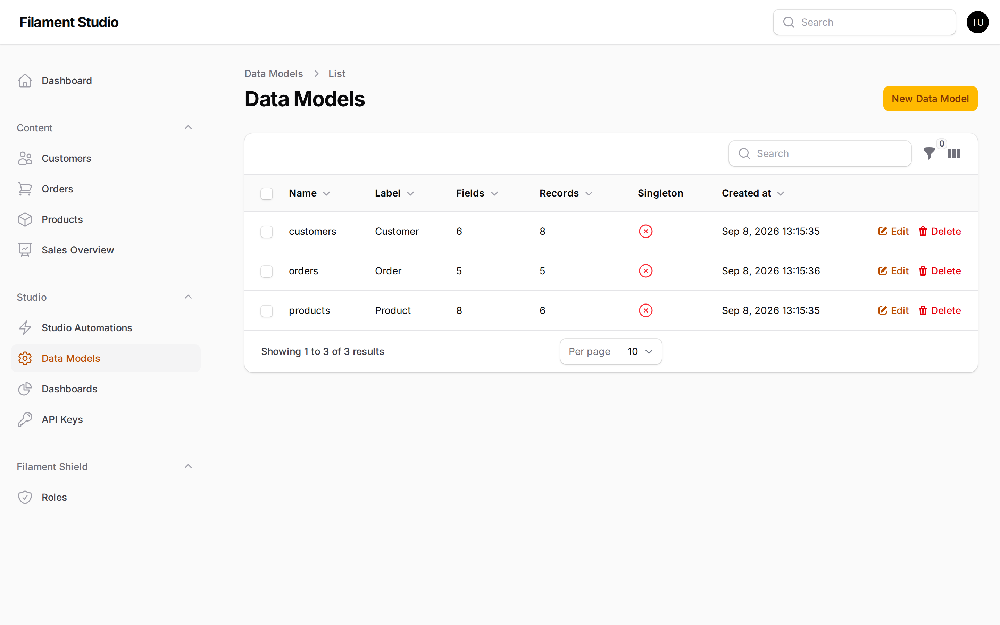
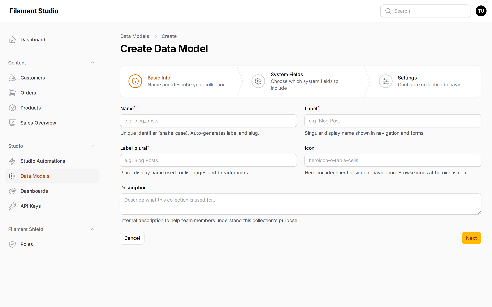
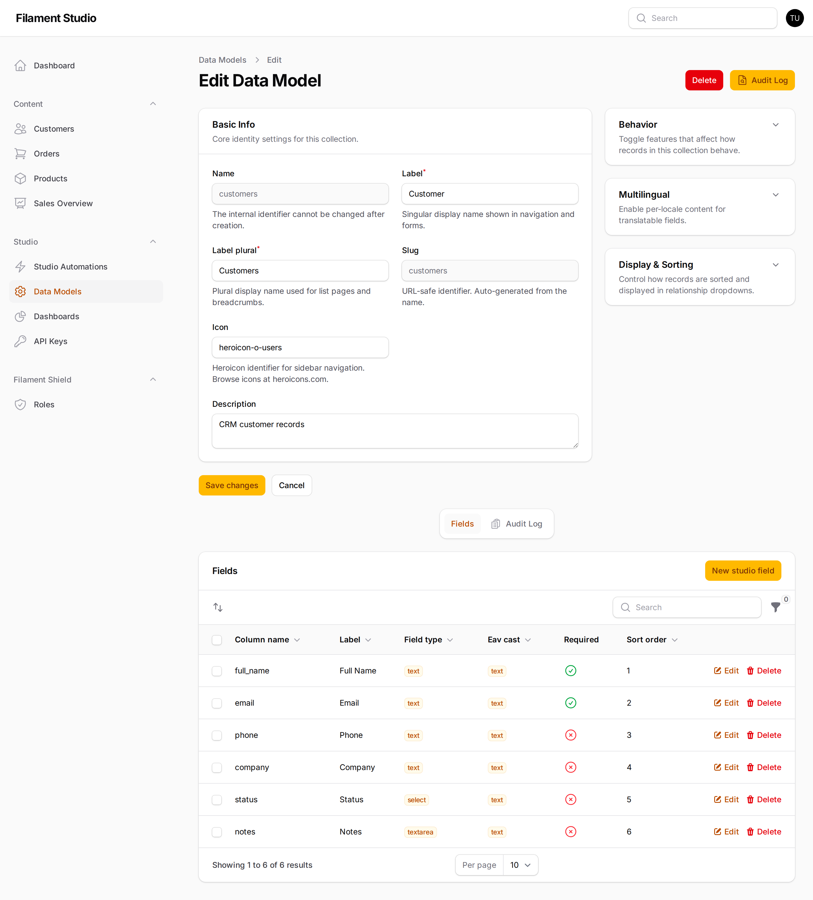

[← Signing in](01-getting-started.md) · [Contents](README.md) · Next: [Adding and editing fields →](03-fields.md)

# 2. Working with collections

## What a collection is

A **collection** is a container for one kind of thing. "Customers" is a collection. So is "Products", "Invoices", "Job Applications" or "Meeting Rooms".

If it helps, picture a spreadsheet. The collection is the whole sheet. The columns are [fields](03-fields.md). The rows are [records](04-records.md).

The useful part: creating a collection in Studio immediately gives you a working screen for it — a list, a create form, an edit form, search filters, and permissions — without anyone writing code.

## Seeing the collections you have

Go to **Studio → Data Models**.

Each row is one collection. The columns tell you:

- **Name** — the internal name, always lowercase with underscores. You'll rarely need this.
- **Label** — the friendly singular name shown to people ("Customer")
- **Fields** — how many pieces of information each record holds
- **Records** — how many entries currently exist
- **Singleton** — whether this collection holds exactly one record (explained below)
- **Created at** — when it was set up

> **Data Models vs Content.** *Data Models* is where you change the **structure** — what fields exist. The entries under *Content* are where you work with the **data** itself. Changing a collection here affects everyone who uses it, so it's usually restricted to administrators.

## Creating a collection

Choose **New Data Model** at the top right. Studio walks you through three steps.

### Step 1 — Basic Info

| Setting | What to put in it |
|---------|-------------------|
| **Name** | The internal name, lowercase with underscores: `blog_posts`. Fills in automatically from the label. **This cannot be changed later**, so take a moment over it. |
| **Label** | The friendly name for one item: "Blog Post" |
| **Label plural** | The friendly name for several: "Blog Posts" |
| **Icon** | The little picture in the sidebar. Type a name from [heroicons.com](https://heroicons.com), like `heroicon-o-document-text`. |
| **Description** | A note for your colleagues explaining what this collection is for. Only shown to administrators. |

Getting singular and plural right matters more than it sounds — Studio uses them everywhere, so a mistake shows up on every button and page title.

### Step 2 — System Fields

Studio offers to add some standard fields automatically. These record things like when each entry was created and who created it. If you're unsure, accept the defaults — they're useful and harmless.

### Step 3 — Settings

This is where you turn on the optional behaviours:

| Setting | What it does | Turn it on when |
|---------|--------------|-----------------|
| **Enable versioning** | Keeps a history of every change so you can look back and restore | The data matters and mistakes need undoing — see [History and undoing mistakes](07-history-and-recovery.md) |
| **Enable soft deletes** | Deleted records are marked deleted rather than destroyed, so an administrator can recover them | You'd rather recover an accidental deletion than explain it |
| **API enabled** | Lets other software read and write this collection | Another system needs this data — see [Connecting other systems](10-connecting-systems.md) |
| **Singleton** | The collection holds exactly one record | You're storing settings — "Company Details", "Homepage Content" — where "a list of them" makes no sense |
| **Hidden** | Keeps it out of the sidebar | It's only used behind the scenes by an automation |
| **Sort field / direction** | The order records appear in by default | You want newest first, or alphabetical by name |

Choose **Create** and your collection exists. It appears in the sidebar straight away — though it has no fields yet, which is the [next chapter](03-fields.md).

## Changing a collection later

Choose **Edit** on any row in the Data Models list.

The top half holds the same settings you chose when creating it, grouped into panels you can expand and collapse:

- **Basic Info** — names, icon, description
- **Behavior** — versioning, soft deletes, and the other toggles
- **Multilingual** — turn on per-language content, if your panel supports more than one language
- **Display & Sorting** — the default order records appear in

The bottom half is the **Fields** list — the subject of the [next chapter](03-fields.md).

Remember to choose **Save changes** after editing the top half. The Fields list below saves each change as you make it, which is why it has its own buttons.

## Deleting a collection

The **Delete** button is on the collection's edit screen, at the top right.

> **This deletes every record in the collection, permanently.** Soft deletes protect individual records, not the collection itself. If there's any doubt, hide the collection instead — it disappears from the sidebar but the data stays safe.

## Common questions

**Can I rename a collection?** You can change the Label and Label plural freely — those are just display text. The internal **Name** is fixed once created, because other things (automations, API integrations, saved filters) refer to it.

**How many collections can I have?** There's no limit. Studio stores all collections in the same underlying tables, so adding your fiftieth costs nothing extra.

**Can one collection link to another?** Yes — that's what relationship fields are for. See [Adding and editing fields](03-fields.md#linking-to-other-collections).

---

[← Signing in](01-getting-started.md) · [Contents](README.md) · Next: [Adding and editing fields →](03-fields.md)
