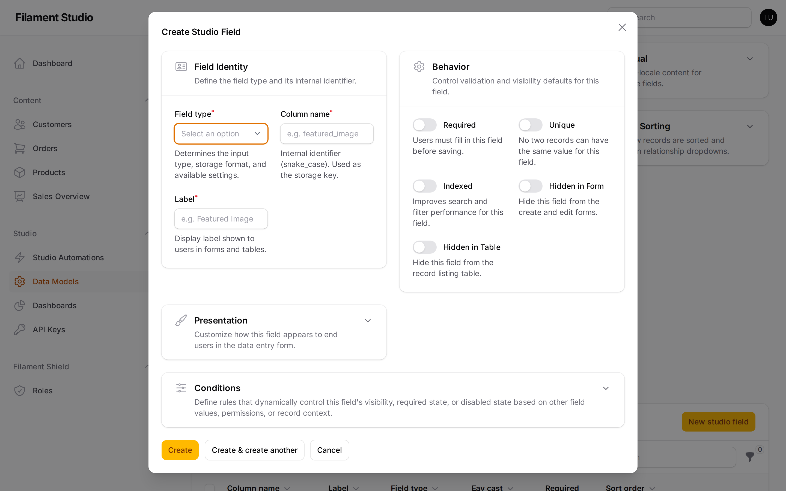
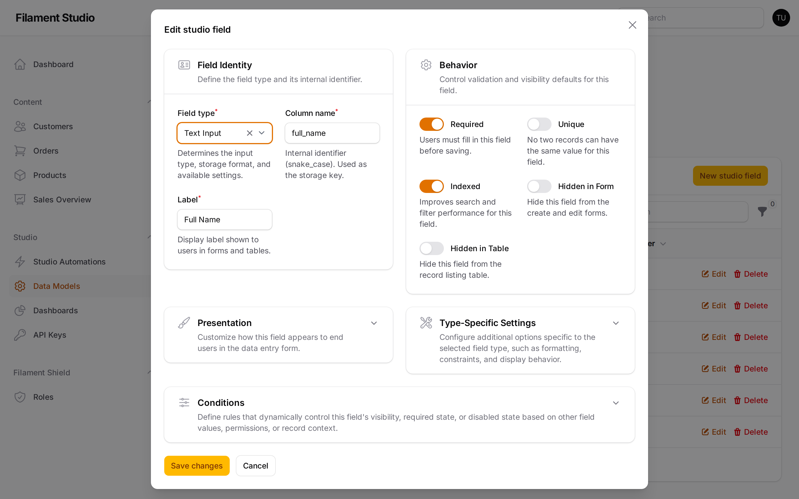
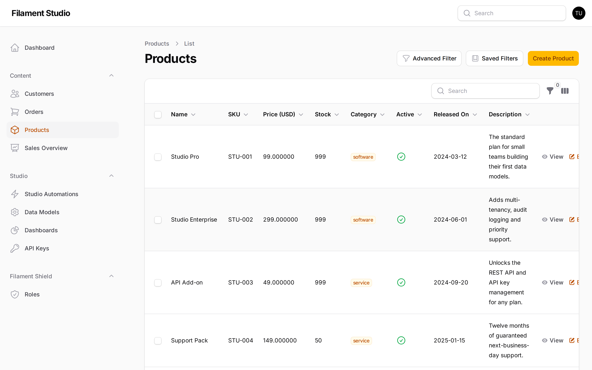

[← Working with collections](02-collections.md) · [Contents](README.md) · Next: [Adding and editing records →](04-records.md)

# 3. Adding and editing fields

## What a field is

A **field** is one piece of information you want to record about every item in a collection. "Email address" is a field. So is "Price", "Date of birth", "Is active" and "Product photo".

Fields are the columns of your spreadsheet. Choosing them well is most of the work of setting up a collection — and unlike the collection's name, you can add, change and remove them whenever you like.

## Seeing the fields a collection has

Go to **Studio → Data Models**, choose **Edit** on a collection, and scroll down to the **Fields** panel.

Each row is one field:

- **Column name** — the internal name (`full_name`)
- **Label** — what people actually see on the form ("Full Name")
- **Field type** — what kind of information it holds
- **Eav cast** — how it's stored underneath. You can ignore this; Studio picks it for you.
- **Required** — a green tick means the field must be filled in
- **Sort order** — the position on the form; lower numbers come first

## Adding a field

Choose **New studio field**.

The form is in four sections. Only the first two matter most of the time.

### Field Identity

| Setting | What to put in it |
|---------|-------------------|
| **Field type** | What kind of information this is. See [the field type guide](#which-field-type-should-i-use) below. |
| **Column name** | The internal name, lowercase with underscores: `preferred_contact`. Fills in from the label. |
| **Label** | What people see on the form: "Preferred contact method" |

### Behavior

These are the toggles that control how the field behaves:

| Toggle | What it does |
|--------|--------------|
| **Required** | The record can't be saved with this left empty. Use sparingly — every required field is a chance for someone to get stuck. |
| **Unique** | No two records may have the same value. Right for email addresses and reference numbers; wrong for names. |
| **Indexed** | Makes filtering on this field faster. Worth turning on for fields you filter by often. |
| **Hidden in Form** | The field exists and holds data, but nobody sees it when adding or editing. Usually for values set automatically. |
| **Hidden in Table** | The field doesn't appear as a column in the list. Useful for long text that would make the table unreadable. |

### Presentation

Controls how the field looks — its width on the form, help text shown underneath it, and a placeholder. Worth a visit for fields people find confusing; safe to skip otherwise.

### Conditions

Lets a field appear, become required, or grey out depending on what's in *other* fields. For example: only show "Reason for cancellation" when Status is set to "Cancelled".

This keeps long forms manageable by hiding what isn't relevant yet. It's the most advanced part of field setup — leave it alone until you have a form that genuinely needs it.

Choose **Create**, or **Create & create another** if you're adding several in a row.

## Editing an existing field

Choose **Edit** on any field row.

You can change almost anything, including the field type. Changing the type of a field that already holds data can lose information, though — turning a text field into a number can only keep the values that were numbers to begin with. Studio will warn you, but it's worth thinking twice.

## Reordering fields

The **Sort order** number controls where each field appears on the form. Lower numbers come first. Change the numbers and save to rearrange.

Group related fields together and put required fields near the top. A form that reads in a sensible order gets filled in correctly far more often.

## Which field type should I use?

Studio has 33 field types. Rather than listing them by category, here they are by the question you're actually asking.

### I want to store some words

| Type | Use it for | Notes |
|------|-----------|-------|
| **Text** | Names, titles, reference numbers | A single line |
| **Textarea** | Notes, descriptions, addresses | Several lines, no formatting |
| **Rich Editor** | Content with bold, italics, links and lists | Gives people a toolbar |
| **Markdown** | Content for people comfortable with markdown | Plain text with simple formatting marks |
| **Password** | Passwords and secrets | Shown as dots while typing |
| **Slug** | The web-address version of a title | `my-blog-post` — usually filled in automatically |
| **Color** | A colour choice | Shows a colour picker |
| **Hidden** | Values set behind the scenes | Never visible on the form |

### I want to store a number

| Type | Use it for |
|------|-----------|
| **Integer** | Whole numbers — quantities, counts, ages |
| **Decimal** | Numbers with a fractional part — prices, weights, percentages |
| **Range** | A number chosen with a slider rather than typed |

### I want a yes or no

| Type | Use it for |
|------|-----------|
| **Checkbox** | A box to tick — "I agree to the terms" |
| **Toggle** | A switch to flip — "Active", "Published". Reads better for on/off states. |

### I want people to choose from a list

| Type | Use it for |
|------|-----------|
| **Select** | One choice from a dropdown — a status, a category |
| **Multi-Select** | Several choices from a dropdown |
| **Radio** | One choice, with all options visible at once. Good for three or four options. |
| **Checkbox List** | Several choices, all visible at once |
| **Tags** | Free-form labels that people type themselves |

When you pick one of these, you'll be asked to define the available options — each one has a value stored underneath and a label people see.

### I want a date or a time

| Type | Use it for |
|------|-----------|
| **Date** | A day — a birthday, a deadline |
| **Time** | A time of day — an appointment slot |
| **Datetime** | A specific moment — when something happened |

### I want to attach a file

| Type | Use it for |
|------|-----------|
| **File** | Any document — a PDF, a spreadsheet |
| **Image** | Pictures, with a preview shown |
| **Avatar** | A profile picture, displayed as a circle |

### Linking to other collections

This is how you connect your data together.

| Type | Use it for | Example |
|------|-----------|---------|
| **Belongs To** | Each record points at one record in another collection | Each *Order* belongs to one *Customer* |
| **Has Many** | Each record has several records from another collection | Each *Customer* has many *Orders* |
| **Belongs To Many** | Records connect to several, in both directions | Each *Product* is in many *Categories*, and each *Category* has many *Products* |

The usual case is **Belongs To**. If you're unsure, ask which side "owns" the relationship: an order can't exist without its customer, so *Order* belongs to *Customer*.

### I want to store something more complicated

| Type | Use it for |
|------|-----------|
| **Repeater** | A repeating set of fields — several phone numbers, each with a label and a number |
| **Builder** | Blocks of different kinds stacked up — how flexible page content is often built |
| **Key-Value** | A simple list of labels and values |

### I want to make the form easier to read

These hold no data at all. They exist purely to organise the form:

| Type | What it does |
|------|--------------|
| **Section Header** | A heading that breaks a long form into parts |
| **Divider** | A horizontal line |
| **Callout** | A highlighted box for a warning or a note |

On any form longer than about ten fields, a few section headers make a dramatic difference.

## Field types in practice

Here is a Products collection using several types at once — text for the name and SKU, decimal for the price, integer for stock, a select for the category, a toggle for active, a date for the release, and a rich editor for the description:

Notice how each type presents itself differently in the table: the select shows as a coloured badge, the toggle as a tick or cross, the date in a readable format. You get that formatting automatically by choosing the right type — which is the main reason it's worth choosing carefully rather than making everything a text field.

## A word of advice on field design

The temptation is to add every field you can imagine anyone ever wanting. Resist it. Every field is one more thing for a colleague to fill in, ignore, or get wrong.

Start with the fields you know you need. Adding a field later takes about thirty seconds and requires no developer — which is the whole point.

---

[← Working with collections](02-collections.md) · [Contents](README.md) · Next: [Adding and editing records →](04-records.md)
