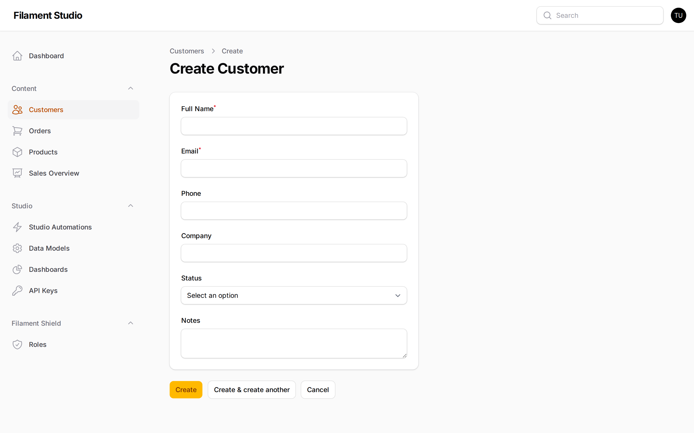
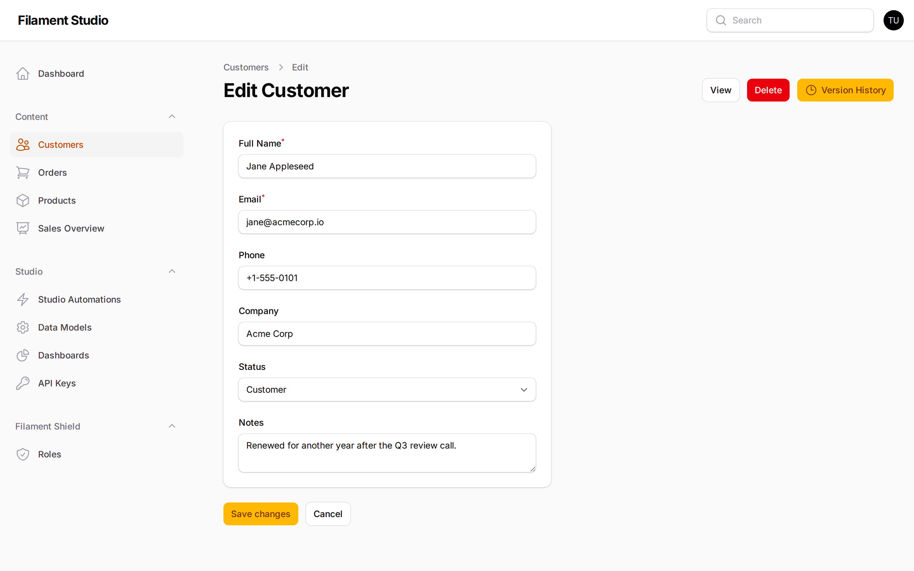

[← Adding and editing fields](03-fields.md) · [Contents](README.md) · Next: [Finding the records you need →](05-finding-data.md)

# 4. Adding and editing records

## What a record is

A **record** is one entry in a collection — one customer, one product, one order. If the collection is the spreadsheet and the fields are the columns, a record is a single row.

This chapter is the day-to-day work: adding entries, changing them, and removing them. Most people who use a Studio panel spend nearly all their time on this one screen.

## The records list

Choose a collection from the **Content** section of the sidebar.

Each row is one record. The columns are the fields that haven't been hidden from the table.

The buttons at the end of each row act on that record alone:

- **View** — see the record without any risk of changing it
- **Edit** — open it for changes
- **Delete** — remove it

At the bottom, **Showing 1 to 8 of 8 results** tells you how many records exist, and **Per page** controls how many rows you see at once. If you have hundreds of records, raising this to 50 saves a lot of clicking.

The checkboxes down the left let you select several records and act on them together — most usefully, deleting them in one go.

## Adding a record

Choose the **Create** button at the top right — it's named after your collection, so on the Customers screen it says *Create Customer*.

Fill in the form and choose **Create**.

Things to know:

- **Fields marked with a red asterisk are required.** You can't save without them.
- **Some fields may appear as you type.** If someone has set up conditions, a field can be hidden until it becomes relevant.
- **Your changes are not saved until you choose Create.** Navigating away discards them.

If something's wrong — a required field left empty, an email address in the wrong shape, a value that duplicates another record when it's meant to be unique — Studio will tell you in red under the field concerned, and won't save until it's fixed.

## Editing a record

Choose **Edit** on any row.

The form is the same one you used to create it, filled in with the current values. Change what you need and choose **Save changes**.

The buttons at the top right offer more:

- **View** — switch to the read-only version
- **Delete** — remove this record
- **Version History** — if the collection has versioning turned on, look back at every previous version and restore one. See [History and undoing mistakes](07-history-and-recovery.md).

## Deleting a record

Choose **Delete**, either from the row in the list or from the top of the edit screen. You'll be asked to confirm.

What happens next depends on how the collection was set up:

- **With soft deletes turned on**, the record is marked deleted rather than destroyed. It disappears from the list, and recovering it needs an administrator — there is no undo button in the panel. See [History and undoing mistakes](07-history-and-recovery.md).
- **Without soft deletes**, the record and its values are gone permanently.

Either way, treat deleting as final. If you're not sure which applies to your collection, check with your administrator before deleting anything important.

## Working in more than one language

If your panel has multilingual content turned on *and* the collection has been given a list of supported languages, the record editor shows a language switcher. Choose a language, and any field marked translatable shows that language's version.

Fields that aren't translatable — dates, numbers, yes/no toggles — hold a single value shared across every language. That's deliberate: a price of 49.99 is the same number in French.

If a translation is missing, Studio falls back to the default language rather than showing an empty space, so nothing looks broken to your visitors while a translation is still being written.

## A worked example

Say a new customer calls and you want to record them.

1. Choose **Customers** in the sidebar
2. Choose **Create Customer**
3. Fill in **Full Name** and **Email** — the two required fields
4. Set **Status** to *Lead*, since they haven't bought anything yet
5. Put anything useful in **Notes** — "Called about enterprise pricing, follow up Tuesday"
6. Choose **Create**

They appear in the list immediately. Later, when they buy something, open them again, change **Status** to *Customer*, and choose **Save changes**. If versioning is on, that change is recorded — so in six months you can still see exactly when they converted.

---

[← Adding and editing fields](03-fields.md) · [Contents](README.md) · Next: [Finding the records you need →](05-finding-data.md)
