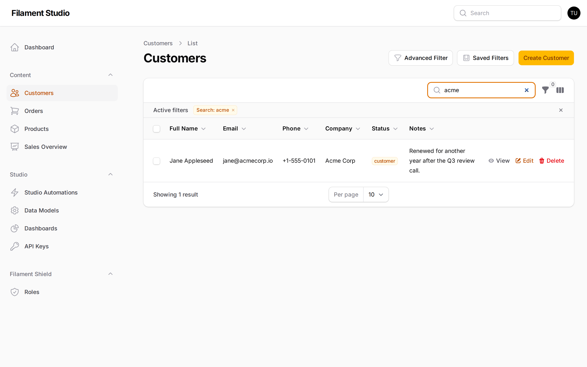
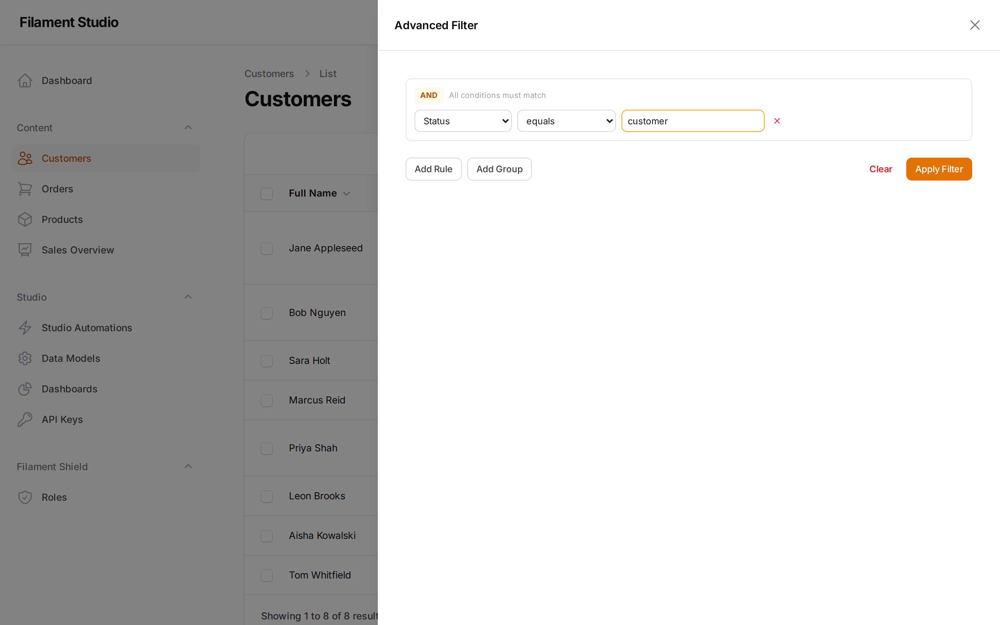
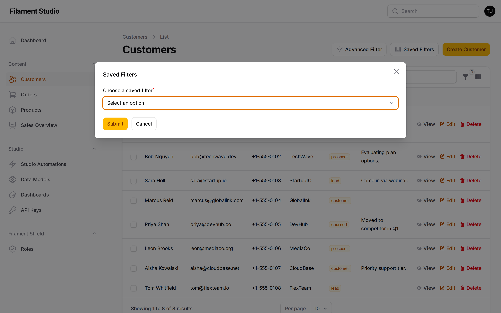

[← Adding and editing records](04-records.md) · [Contents](README.md) · Next: [Building dashboards →](06-dashboards.md)

# 5. Finding the records you need

Once a collection holds more than a screenful of records, you need ways to narrow it down. Studio gives you four, in increasing order of power: search, sorting, the advanced filter, and saved filters.

## Search

The quickest tool. Type into the search box above the table and the list narrows as you type.



Search looks across *every* visible field at once, so you don't have to say which one you mean. In the picture, "acme" found Jane Appleseed — not because of her name, but because her **Company** is Acme Corp and her email is at acmecorp.io. Matching is partial and ignores capitalisation, so "acme" finds "Acme Corp".

Once a search is active, an **Active filters** strip appears above the table showing what's applied. Clear it with the small × beside it, or the × in the search box.

Use search when you know something distinctive about the record you want. When you need "all records where…" rather than "the record that mentions…", use the advanced filter below.

## Sorting

Every column heading in the table has a small arrow next to it. Click the heading to sort by that column; click again to reverse it.

This is the quickest way to answer questions like "which products are almost out of stock" — sort by Stock, smallest first, and the answer is at the top.

Sorting is temporary. It lasts as long as you're on the page and resets when you come back.

## The advanced filter

Sorting reorders everything. Filtering *removes* the records you don't care about. This is the tool for real questions.

Choose **Advanced Filter** at the top of any records list.



### Building a single rule

A rule has three parts, read left to right as a sentence:

**Status** — **equals** — **customer**

1. **Pick the field** you want to test
2. **Pick the comparison.** The options change to suit the field: text fields offer *contains* and *starts with*, numbers offer *greater than* and *less than*, dates offer *before* and *after*.
3. **Type the value** to compare against

Choose **Apply Filter** and the list narrows to matching records.

> **Only some fields appear in the dropdown.** A field has to be marked *filterable* before it can be used here. If a field you want is missing, an administrator can turn it on — see [Adding and editing fields](03-fields.md).

### Combining rules

Choose **Add Rule** for a second condition. The **AND** badge at the top of the group controls how they combine:

- **AND** — every rule must match. *Status is customer* **and** *Company contains Ltd*. Each rule you add makes the result smaller.
- **OR** — any rule may match. *Status is lead* **or** *Status is prospect*. Each rule you add makes the result bigger.

Click the AND badge to switch it to OR.

### Groups, for the harder questions

**Add Group** creates a bracketed sub-condition with its own AND/OR setting. This is how you express questions that mix the two.

Take: *customers in Germany who are either overdue or high-value*. That's an AND (they must be in Germany) containing an OR (overdue or high-value):

```
Country equals Germany
AND
  ( Payment status equals Overdue
    OR
    Lifetime value greater than 10000 )
```

Build it as a rule for the country, then a group set to OR holding the other two conditions.

If you find yourself building something like this more than once, save it — which is the next section.

### Clearing a filter

**Clear** empties the builder. Once a filter is applied, the records list shows an *Active filters* strip above the table with a small × to remove it.

## Saved filters

A filter you've built can be kept and reused. Choose **Saved Filters** at the top of the records list.



Pick a saved filter from the dropdown and choose **Submit** to apply it.

Saved filters can be **shared** with everyone who can see the collection, or kept private to you. Shared ones are how a team agrees on what "active customer" or "needs following up" actually means — instead of each person rebuilding a slightly different filter, everyone uses the same one.

Good candidates for saving:

- The view you open first thing every morning
- Anything you'd otherwise rebuild more than twice
- Definitions the whole team should agree on

## Which should I use?

| You want to... | Use |
|----------------|-----|
| Find one record you can describe | The search box |
| Reorder what's already on screen | Click a column heading |
| Answer a one-off question | The advanced filter |
| Answer the same question repeatedly | A saved filter |
| Watch a number over time | A [dashboard](06-dashboards.md) |

---

[← Adding and editing records](04-records.md) · [Contents](README.md) · Next: [Building dashboards →](06-dashboards.md)
