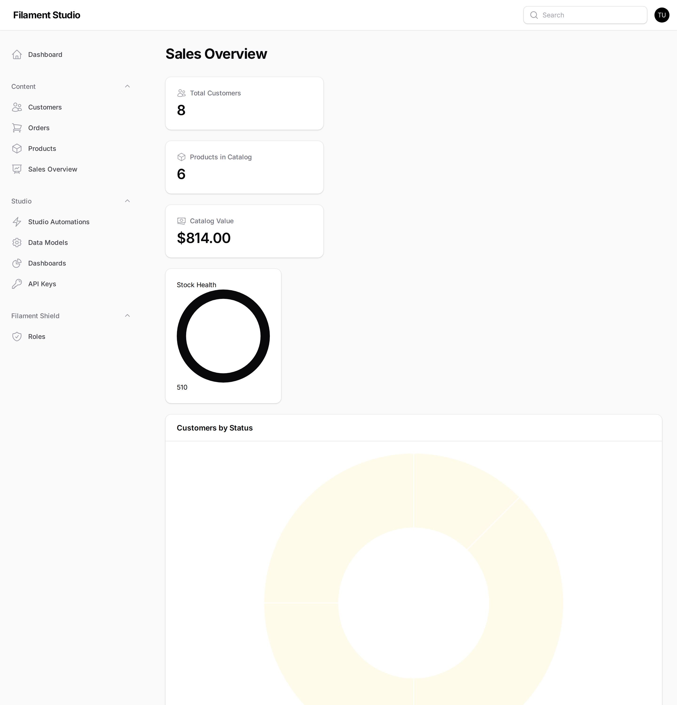
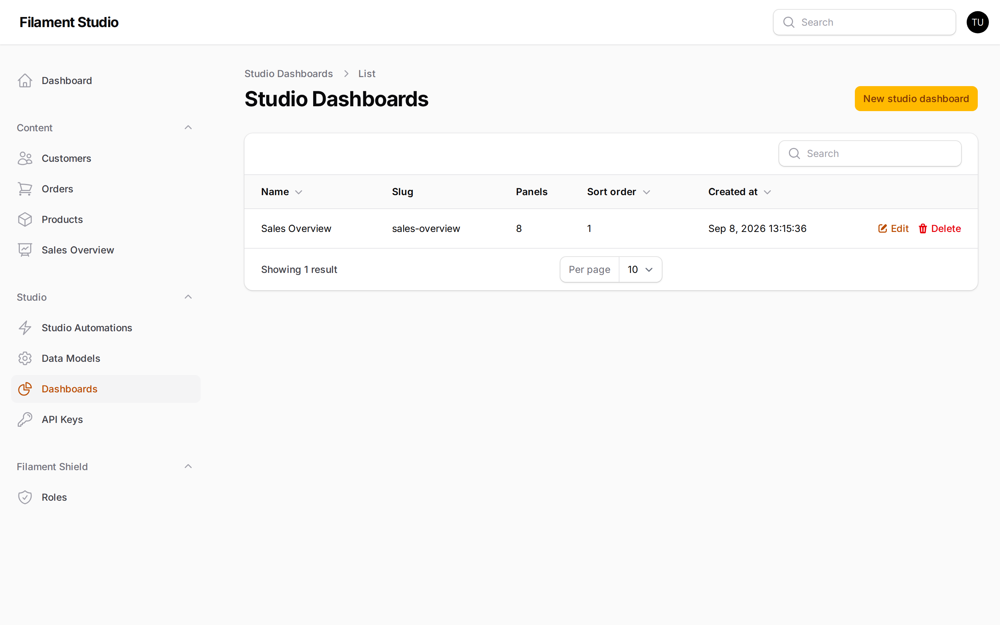
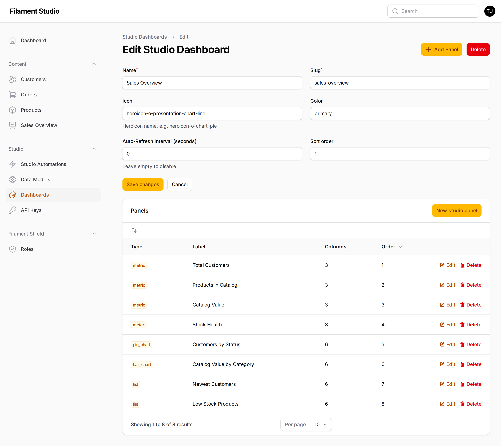

[← Finding the records you need](05-finding-data.md) · [Contents](README.md) · Next: [History and undoing mistakes →](07-history-and-recovery.md)

# 6. Building dashboards

## What a dashboard is

A **dashboard** is a page of summaries — the numbers, charts and short lists that tell you how things are going without reading through every record.

Filters answer *"which records match this?"*. Dashboards answer *"how are we doing?"*.

You build one by choosing panels from a list and configuring each with a few dropdowns. No code, no developer.

## Viewing a dashboard

Dashboards you have access to appear in the **Content** section of the sidebar, under their own name.

This one, *Sales Overview*, shows the total number of customers, how many products are in the catalogue, the catalogue's total value, average stock levels, and a breakdown of customers by status.

Everything is live. The numbers reflect your data as it is right now, recalculated each time you open the page.

## Creating a dashboard

Go to **Studio → Dashboards** and choose **New studio dashboard**.

Give it a name, a web-address slug, an icon and a sort order (which controls where it sits in the sidebar). Then choose **Create** and start adding panels.

## Adding panels

Open a dashboard for editing to reach the panel list.

Each panel needs three decisions: what **type** it is, which **collection** it draws from, and which **field** it summarises.

### The nine panel types

**For showing a single number:**

| Panel | What it shows | Good for |
|-------|---------------|----------|
| **Metric** | One big number | "Total Customers", "Revenue This Month" |
| **Meter** | A number as a filled ring, against a maximum | Progress towards a target, capacity used |
| **Label** | Fixed text you type in | Headings and notes between other panels |

**For showing a shape or trend:**

| Panel | What it shows | Good for |
|-------|---------------|----------|
| **Bar Chart** | Bars comparing categories | Sales by region, value by category |
| **Pie Chart** | Slices of a whole | Customers by status, share by product line |
| **Line Chart** | A line connecting points | Anything measured repeatedly |
| **Time Series** | A line specifically over time | Orders per day, signups per week |

**For showing actual records:**

| Panel | What it shows | Good for |
|-------|---------------|----------|
| **List** | A short list of records | "Newest customers", "Low stock products" |
| **Variable** | A control that changes other panels | Letting the viewer pick a date range or region |

### Summarising: the aggregate function

Panels that show a number ask how to work it out:

| Function | What it does | Example |
|----------|--------------|---------|
| **Count** | How many records | "How many customers do we have?" |
| **Sum** | Adds the values together | "What's the total value of all orders?" |
| **Average** | The mean value | "What's our average order size?" |
| **Minimum** | The smallest value | "What's the cheapest product?" |
| **Maximum** | The largest value | "What's our biggest order?" |

**Count** answers *how many*. The other four answer *how much*, and need a number field to work on.

### Charts need one extra decision

Bar and pie charts split data into groups, so they ask for a **group field** as well — the field whose distinct values become the bars or slices. Grouping customers by *Status* gives you one slice per status.

Pick a group field with a small number of possible values. Grouping by *Status* (four values) gives a readable chart; grouping by *Email address* gives one slice per customer and tells you nothing.

## Placing panels

Panels can go in five places:

| Placement | Where it appears |
|-----------|------------------|
| **Dashboard** | On the dashboard page itself |
| **Collection header** | Above a collection's records list |
| **Collection footer** | Below a collection's records list |
| **Record header** | Above a single record |
| **Record footer** | Below a single record |

The last four are worth knowing about. A metric at the top of the Orders list showing today's total, or a panel on each customer showing their lifetime value, puts the answer exactly where the question gets asked.

## Values that fill themselves in

Panels understand a few special values that change depending on who's looking and when:

| Value | Becomes |
|-------|---------|
| `$CURRENT_USER` | The person viewing the page |
| `$CURRENT_TENANT` | The organisation they belong to |
| `$NOW` | The current date and time |
| `$NOW(+1 day)` | Tomorrow — you can add or subtract periods |

These make one panel do the work of many. A list panel filtered to `$CURRENT_USER` becomes "my open tasks" for everyone who looks at it, without building a version per person.

## Advice on building a dashboard people use

**Answer questions, don't display data.** Before adding a panel, say out loud what question it answers. If you can't, leave it out.

**Put the important thing first.** People read the top-left and stop. The number that matters most goes there.

**Four good panels beat twelve mediocre ones.** A dashboard nobody can take in at a glance gets ignored, and an ignored dashboard is worse than none — it looks like oversight while providing none.

---

[← Finding the records you need](05-finding-data.md) · [Contents](README.md) · Next: [History and undoing mistakes →](07-history-and-recovery.md)
