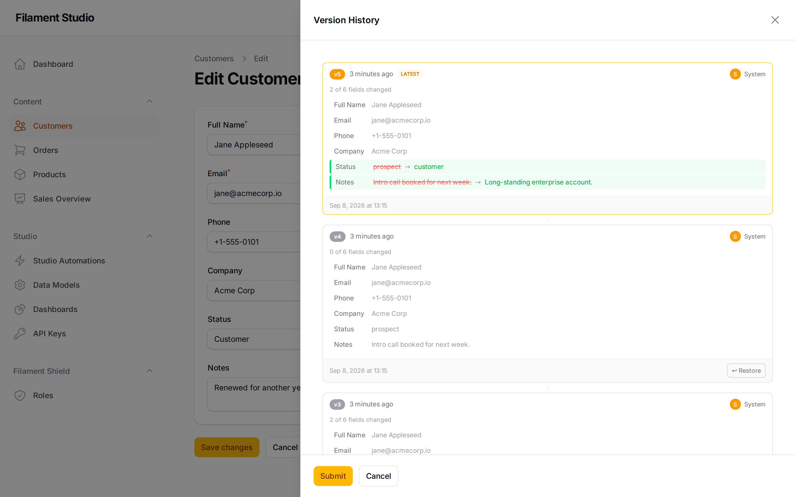

[← Building dashboards](06-dashboards.md) · [Contents](README.md) · Next: [Controlling who can do what →](08-permissions.md)

# 7. History and undoing mistakes

Two features exist to make mistakes survivable: **version history**, which remembers every change to a record, and **soft deletes**, which stop deletions being final. Both are optional and switched on per collection.

## Version history

### What it does

When versioning is turned on for a collection, Studio takes a snapshot of a record every time it changes. You can look back through those snapshots and restore any one of them.

This answers the questions that otherwise become arguments: *who changed this price?*, *what did this say last week?*, *can we put it back?*

### Looking at a record's history

Open a record for editing and choose **Version History** at the top right.

Each block is one version, newest at the top. The most recent is marked **LATEST**.

Each one tells you:

- **When it was saved** — "1 hour ago", with the exact date underneath
- **Who saved it** — the person, or *System* if an automation did it
- **How much changed** — "2 of 6 fields changed"
- **What the values were** — every field, with changes highlighted

Changed values show the old and the new: **prospect → customer**. Text that was removed is struck through and text that was added follows it, so you can see exactly what happened at a glance.

### Restoring an earlier version

Each version below the latest has a **Restore** button. Choose it, and the record's values are set back to that snapshot.

Two things worth knowing:

- **Restoring creates a new version.** It doesn't erase what came after — it adds a new entry at the top with the old values. The history stays complete, and you can undo the restore.
- **It restores every field** in that snapshot, not just the ones you were looking at.

### Turning it on

Versioning is a collection setting. An administrator can enable it on the collection's edit screen under **Behavior** — see [Working with collections](02-collections.md).

It only records changes made *after* it was turned on. Enabling it today gives you no history of yesterday, so it's worth turning on early for anything that matters.

## Soft deletes

### What it does

Normally, deleting a record destroys it and everything stored in it. With **soft deletes** turned on, a deleted record is only *marked* as deleted: it disappears from the list and from reports, but the record and all its values stay in the database.

Think of it as writing "deleted" on a folder and moving it to the back of the cabinet, rather than shredding it.

### Recovering a deleted record

**There is currently no button in the panel for this.** Turning on soft deletes means a deletion *can* be undone — it doesn't give you a recycle bin screen to undo it from.

If you delete something by accident on a collection with soft deletes enabled, the data is still there and is recoverable, but somebody with database or developer access has to bring it back for you. Ask your administrator, and ask sooner rather than later.

The practical consequence: soft deletes are insurance, not a self-service undo. Treat every deletion in the panel as final, and rely on soft deletes only as the thing that makes an expensive mistake survivable.

### Turning it on

Like versioning, it's a collection setting under **Behavior**, and it only applies to deletions made after it's enabled. Anything deleted before then is already gone.

## Which should be turned on?

| Situation | Versioning | Soft deletes |
|-----------|-----------|--------------|
| Financial records, contracts, anything audited | Yes | Yes |
| Content edited by several people | Yes | Yes |
| Customer and contact records | Yes | Yes |
| Temporary or scratch data | No | No |
| Automatically imported data that's replaced wholesale | No | Maybe |

Both cost a little storage — versioning keeps a copy of the record each time it changes, so a collection edited constantly will accumulate history. For anything a person types by hand, that's a trade worth making. For a table refreshed by an import every night, it usually isn't.

## What neither of these protects you from

Being clear about the limits:

- **Deleting an entire collection.** That removes every record in it, and soft deletes don't apply. See [Working with collections](02-collections.md).
- **Deleting a field.** Removing a field discards the values stored in it.
- **Changes made before the feature was turned on.**

None of this replaces a database backup. It's protection against everyday human error, which is what most data loss actually is — but a real backup is still your administrator's job.

---

[← Building dashboards](06-dashboards.md) · [Contents](README.md) · Next: [Controlling who can do what →](08-permissions.md)
