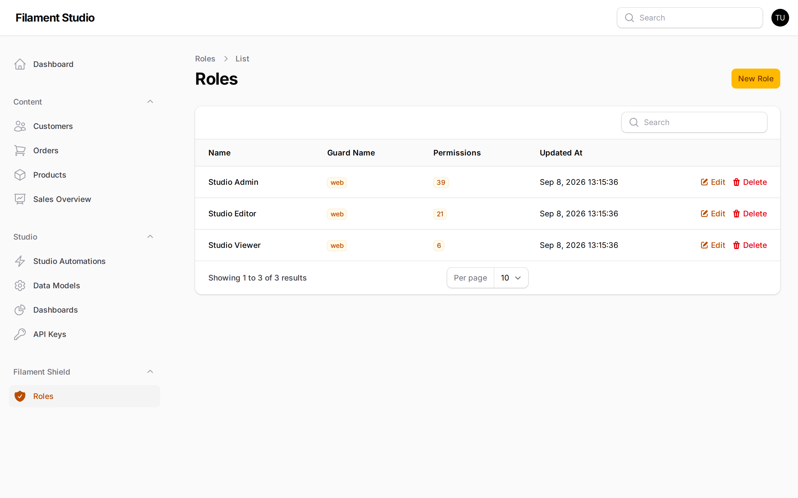

[← History and undoing mistakes](07-history-and-recovery.md) · [Contents](README.md) · Next: [Automations →](09-automations.md)

# 8. Controlling who can do what

Not everyone should be able to do everything. A support agent might need to read customer records but never delete them. A marketing colleague might need the blog collection and nothing else.

Studio handles this with **roles**.

> This chapter describes a panel with the permissions system installed. If your panel doesn't have it, everyone who can sign in can do everything, and the *Roles* section won't appear in your sidebar.

## Roles

A **role** is a named bundle of permissions — *Studio Admin*, *Studio Editor*, *Studio Viewer*. Every person is given one or more roles, and can do the sum of what those roles allow.

You manage people by changing roles, not by ticking boxes for each person. When a new colleague joins, you give them a role and they immediately have exactly the right access.

Go to **Filament Shield → Roles**.

Each row shows the role's name and how many permissions it carries. Choose **Edit** to see and change them.

## What you can grant

Permissions come in two kinds.

### Permissions for the whole panel

These control the setup tools:

| Permission | Lets someone |
|------------|--------------|
| **Manage fields** | Create collections and change their fields — i.e. change the structure of your data |
| **Manage API keys** | Create and revoke the keys that let other software connect |

Both are powerful. Someone who can manage fields can delete a field and everything stored in it. Keep these to the few people who administer the panel.

### Permissions for each collection

Every collection gets its own set of four, so access can differ per collection:

| Permission | Lets someone |
|------------|--------------|
| **View records** | See the list and open individual records |
| **Create record** | Add new ones |
| **Update record** | Change existing ones |
| **Delete record** | Remove them |

This is what makes "read customers, edit products, never touch invoices" straightforward to express.

These permissions are created automatically. Add a collection and its four permissions appear ready to assign; rename or delete the collection and they follow along. Nobody has to remember to keep them in step.

## What people actually see

Permissions aren't just enforced when someone tries something — they shape the interface. If a role can't create records, the **Create** button isn't there. If it can't see a collection at all, the collection isn't in the sidebar.

The result is that people see a panel that looks built for them, rather than one full of buttons that refuse to work.

## Three roles that cover most needs

A pattern worth copying:

**Viewer** — *view records* on the collections they need, and nothing else. Right for people who consult data but never change it.

**Editor** — *view, create* and *update* on their collections, but not *delete*, and no panel-wide permissions. Right for the people doing the daily work. Withholding delete costs them almost nothing and prevents the worst accidents.

**Administrator** — everything, including *manage fields* and *manage API keys*. Right for the one or two people responsible for the panel.

Start here and add specific roles only when a real situation demands one.

## Advice

**Grant the least that works.** It's easy to add a permission when someone asks. It's much harder to notice that someone has had delete rights for a year and never needed them.

**Be careful with "manage fields".** It's the most powerful permission in Studio. Someone with it can restructure or destroy your data model. It belongs with the people who understand the consequences.

**Review roles when people change jobs.** Access accumulates. Someone who's moved teams twice often carries permissions from all three.

**Test by signing in as the role.** The quickest way to know a role is right is to have someone with it try the tasks they actually do.

---

[← History and undoing mistakes](07-history-and-recovery.md) · [Contents](README.md) · Next: [Automations →](09-automations.md)
