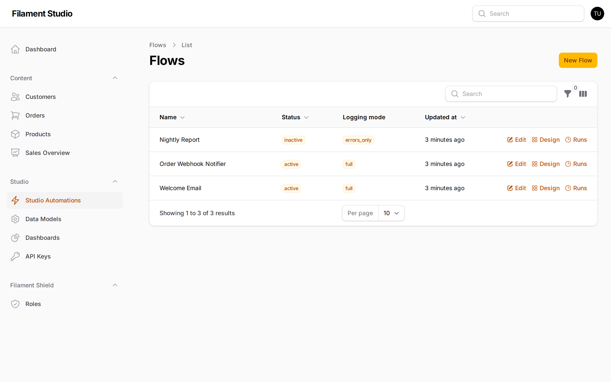
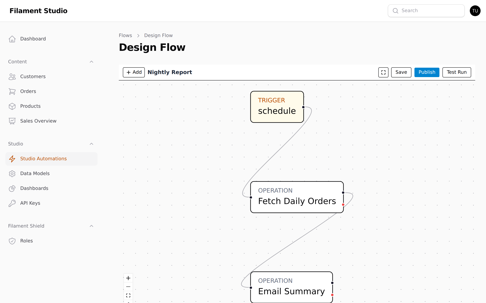
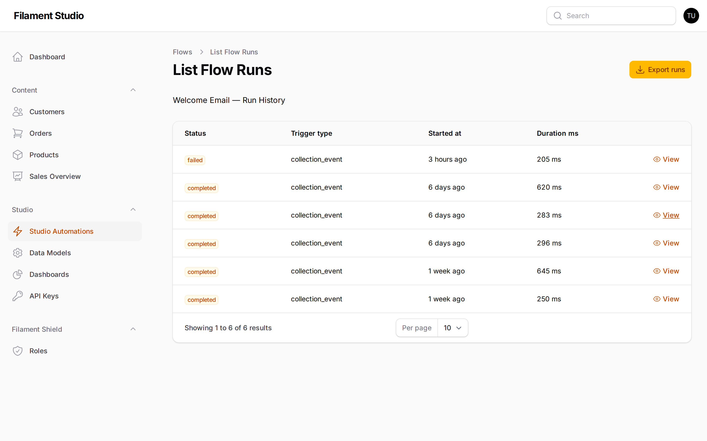

[← Controlling who can do what](08-permissions.md) · [Contents](README.md) · Next: [Connecting other systems →](10-connecting-systems.md)

# 9. Automations

## What an automation is

An **automation** — Studio calls them *flows* — is a set of steps that runs by itself. Something happens, and Studio does the work you'd otherwise do by hand.

For example:

- A new customer is added → send them a welcome email
- An order is marked *shipped* → tell the warehouse system
- Every night at 2am → email a summary of the day's orders

You build one by drawing it: a starting point, then boxes for each step, connected by lines.

> Automations are optional and may not be turned on in your panel. If **Studio Automations** isn't in your sidebar, ask your administrator.

## Seeing your automations

Go to **Studio → Studio Automations**.

Each row is one automation:

- **Name** — what it's called
- **Status** — *active* means it's running when triggered; *inactive* means it's switched off
- **Logging mode** — how much detail is recorded about each run
- **Updated at** — when it last changed

The buttons on each row: **Edit** for its name and settings, **Design** to draw the steps, and **Runs** to see its history.

## The two halves of an automation

Every automation has a **trigger** — what starts it — and one or more **operations** — what it does.

### Triggers: what starts it

| Trigger | Starts when | Use it for |
|---------|-------------|------------|
| **Manual** | You press a button | Something you do occasionally on purpose |
| **Collection event** | A record is created, changed or deleted | Reacting to your data as it changes |
| **Schedule** | A time you choose, repeatedly | Nightly reports, weekly reminders |
| **Webhook** | Another system calls in | Letting an outside service start the work |

**Collection event** is the one most people want. It's how "when a customer is added, do something" works.

### Operations: what it does

| Operation | What it does |
|-----------|--------------|
| **Create / Read / Update / Delete record** | Work with records in your collections |
| **Condition** | Take one path or another depending on a value |
| **Transform payload** | Reshape the information passing through |
| **Send email** | Send a message |
| **HTTP request** | Call another system |
| **Trigger flow** | Run another automation |

**Condition** is what turns a list of steps into something that can make decisions — *if the order is over £500, notify the account manager; otherwise, don't*.

## Drawing an automation

Choose **Design** on any automation.

The canvas shows your automation as connected boxes. This one is *Nightly Report*: a **schedule** trigger, then *Fetch Daily Orders*, then *Email Summary*.

- **Add** puts a new step on the canvas
- **Drag a box** to move it; drag from the edge of one box to another to connect them
- **Click a box** to configure that step
- The lines show the order things happen in

The controls at the top right:

| Button | What it does |
|--------|--------------|
| **Save** | Saves your work as a draft — it does *not* go live |
| **Publish** | Makes the draft the live version |
| **Test Run** | Runs it now so you can see what happens |

## Draft and published — the important part

This trips people up, so it's worth being clear.

Every automation has **two versions**: the **draft** you're editing, and the **published** version that actually runs.

**Save** stores your draft. Nothing changes for anyone. You can leave a half-finished automation saved for a week and it will have no effect.

**Publish** takes your draft and makes it live. From that moment it runs for real.

This means you can safely edit a running automation. Your changes sit in the draft until you're satisfied and deliberately publish them.

Published versions are kept. If a change turns out to be wrong, you can roll back to a previous published version.

**Test Run** executes the automation so you can watch what it does before publishing. Test first, always — particularly for anything that sends messages to real people.

## Watching what happened

Choose **Runs** on any automation.

Each row is one execution:

- **Status** — *completed* if it worked, *failed* if it didn't
- **Trigger type** — what started it
- **Started at** — when
- **Duration** — how long it took

Choose **View** on any run to see it step by step: what each step received, what it produced, how long it took, and — for a failure — exactly which step failed and why.

This is the first place to look when someone says "the email didn't go out". You'll usually see either no run at all (the trigger didn't fire) or a failed run naming the step that broke.

## Things worth being careful about

**Automations that change records can trigger other automations.** An automation that updates a customer can wake up another one listening for customer changes. Studio limits how deep this can go, but it's worth thinking about before you publish.

**Always Test Run before publishing.** Especially anything that emails customers or calls another system. A test run costs seconds; an automation that emails your entire customer list by mistake costs rather more.

**Some operations need extra confirmation to publish.** Steps that delete records or call outside systems are treated as dangerous, and Studio asks you to confirm deliberately. That prompt is a feature — read it rather than clicking through.

**Check the run history after publishing.** Watch the first few real runs. It's much easier to catch a problem in the first hour than to discover it in a month.

---

[← Controlling who can do what](08-permissions.md) · [Contents](README.md) · Next: [Connecting other systems →](10-connecting-systems.md)
