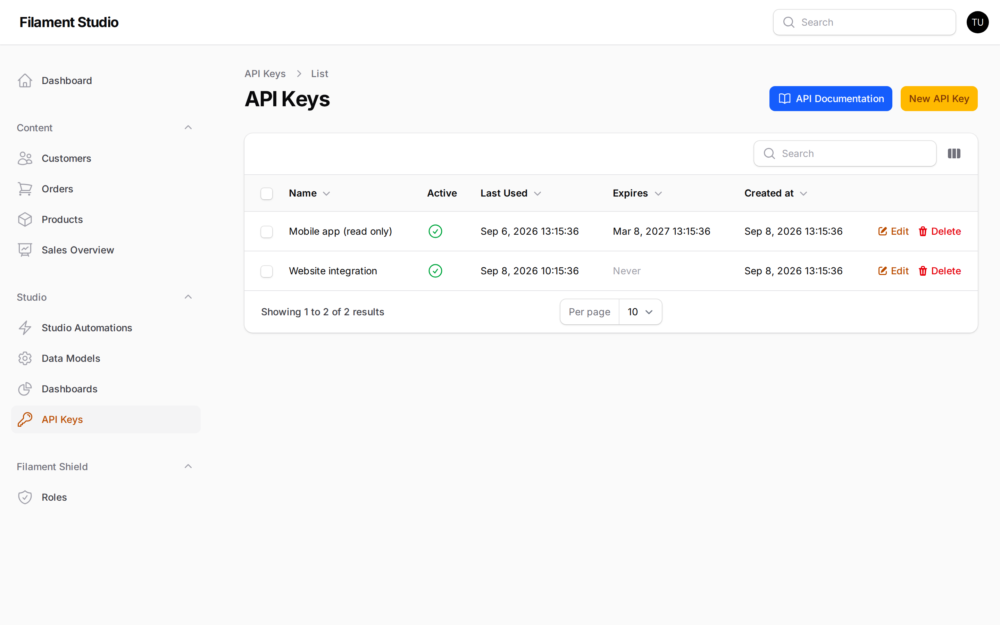
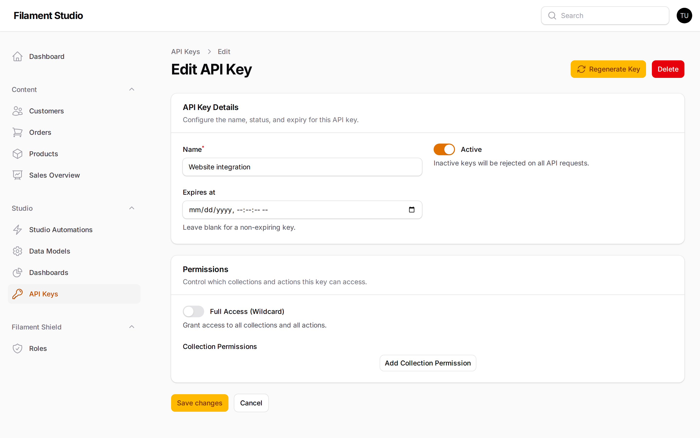
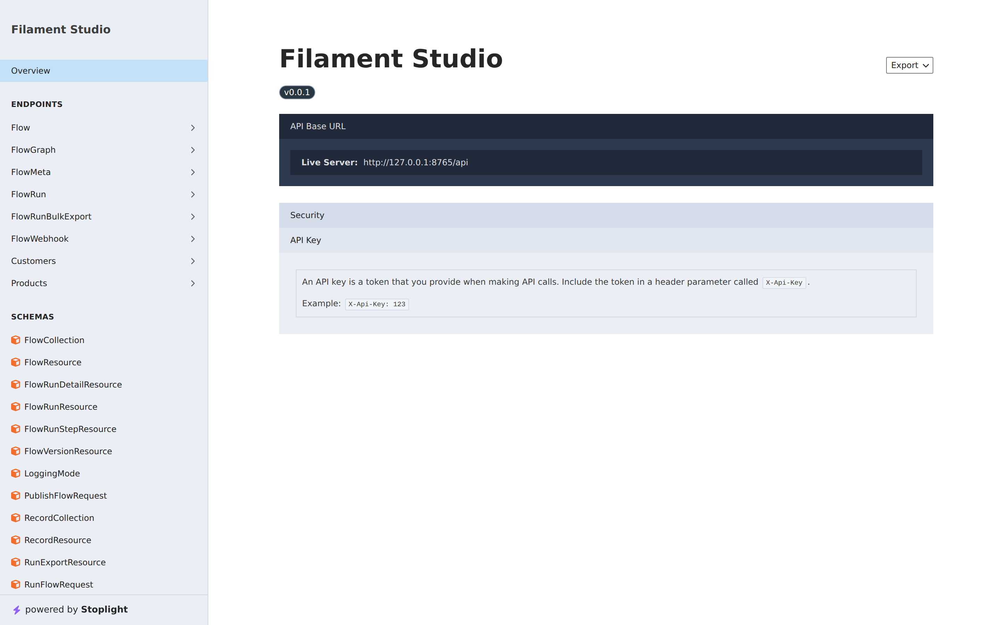

[← Automations](09-automations.md) · [Contents](README.md) · Next: [Glossary →](11-glossary.md)

# 10. Connecting other systems

## Why this chapter exists

Sometimes your data needs to leave the panel. Your public website needs to show the products you maintain here. A reporting tool needs to read your orders. A mobile app needs to add records.

Studio can let other software read and write your collections directly. This chapter explains the part you control — the keys — without going into how a developer uses them.

> Managing API keys is usually an administrator's job. If **API Keys** isn't in your sidebar, your account doesn't have permission, which is normal.

## What an API key is

An **API key** is a long password given to a *program* rather than a person.

When another system wants to read your data, it sends its key along with the request. Studio checks the key, sees what that key is allowed to do, and responds accordingly.

The comparison worth holding on to: an API key is like a key to your building. You can have several, give each to a different contractor, decide which doors each opens, and take one back without changing the locks for everyone else.

## Managing keys

Go to **Studio → API Keys**.

Each row is one key:

- **Name** — what it's for. Name it after the system that uses it: "Website integration", "Mobile app (read only)".
- **Active** — a green tick means it works right now
- **Last Used** — when something last used it. Invaluable for spotting keys nobody needs any more.
- **Expires** — when it stops working, or *Never*
- **Created at** — when it was made

## Creating a key

Choose **New API Key**. You'll be asked for:

**A name.** Be specific. "Test" tells you nothing in six months; "Marketing site product feed" tells you exactly what breaks if you revoke it.

**What it can reach.** Either full access to everything, or a chosen set of collections with a chosen level of access on each — read only, or read and write. Give the least that works. A website showing your product catalogue needs to *read* products; it does not need to *delete* customers.

**An expiry date, optionally.** A key that expires is a key that can't be forgotten about. For anything temporary — a contractor, a trial integration — set one.

> **Copy the key when it's shown to you.** For security, Studio doesn't display the key again afterwards — the edit screen shows the key's settings, not its value. If you lose it, use **Regenerate Key** to issue a fresh one. That immediately invalidates the old value, so anything still using it will stop working until it's given the new key.

## Changing or turning off a key

Open a key with **Edit** to reach its settings.

From here you can:

**Switch *Active* off.** The key stops working immediately but the record stays, so you can switch it back on. Right for "this integration is misbehaving, stop it now while we investigate".

**Change what it can reach.** *Full Access (Wildcard)* grants everything; turn it off and use **Add Collection Permission** to grant specific collections instead.

**Set or clear an expiry.** Leave *Expires at* blank for a key that never expires.

**Regenerate Key** issues a new value and invalidates the old one — the right move if a key has leaked.

**Delete** removes it entirely and permanently. Right for "this system is gone for good".

Either way, anything using that key stops working straight away. Check *Last Used* first — if a key was used ten minutes ago, something still depends on it.

## The documentation page

The **API Documentation** button on the API Keys screen opens a technical reference, generated automatically from your actual collections.

You don't need to read this. But when a developer asks "what does your API look like?", this page is the complete answer, and it's always up to date — add a field and it appears here without anyone writing anything.

## Keeping keys safe

**Treat a key like a password.** Anyone holding it can do everything the key allows. Don't email them, don't put them in chat, don't paste them into a shared document.

**One key per system.** It costs nothing and means you can revoke one integration without breaking the others. Shared keys are how one retired system takes three live ones down with it.

**Review the list occasionally.** Sort by *Last Used*. Anything unused for months is either forgotten or already dead — and every live key is a door.

**Revoke immediately if a key leaks.** Delete it, create a replacement, update the system that needs it. Do it in that order; a leaked key is being used by someone else until it isn't.

---

[← Automations](09-automations.md) · [Contents](README.md) · Next: [Glossary →](11-glossary.md)
